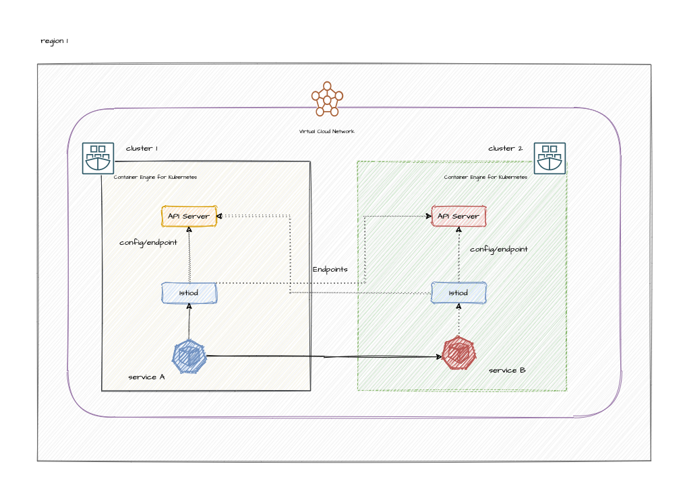

# Demo: Install Multi-Primary on different networks

Steps to orchestrate service mesh with [Istio](https://istio.io/) across two different OKE clusters.



## Prerequisites

- `oci` CLI
- `kubectl`
- `terraform`
- `make`
- `helm` CLI

### Add section for creating terraform variables
```
# terraform.tfvars

api_fingerprint      = "<api_fingerprint>"
api_private_key_path = "<path_to_api_key_file>"
user_id              = "ocid1.user.oc1..xxxxxtpa4pkocl34a"
tenancy_id           = "ocid1.tenancy.oc1..aaaaaaaa"
compartment_id       = "ocid1.compartment.oc1..aaaaaaaa"

istio_regions = {

  home        = "<home_region_id>" #replace with your tenancy's home region   
  cls1_region = "<region_1_id>"
  cls2_region = "<region_2_id>"
}
```

## Set Env Variables

```
export cluster1_oci_profile_name="REGION1"
export cluster2_oci_profile_name="REGION2"
export cluster1_region="<region_1_identifier>"
export cluster2_region="<region_2_identifier>"
export CTX_CLUSTER1=oke_cluster1
export CTX_CLUSTER2=oke_cluster2
export compartment_id="<compartment_ocid>"
export PATH=/tmp/istio-1.18.2/istio-1.18.2/bin:$PATH

```

## Configure OCI cli for two regions

Get the [region](https://docs.oracle.com/en-us/iaas/Content/General/Concepts/regions.htm#About) identifier for OCI

```
## REGION1
[REGION1]
user=ocid1.user.oc1..xxxxxxxx
fingerprint=xxxx
tenancy=ocid1.tenancy.oc1..xxxxxx
region=<region_identifier>
key_file=/home/ubuntu/api-key/api-key.pem

### REGION2
[REGION2]
user=ocid1.user.oc1..xxxxxxxx
fingerprint=xxxx
tenancy=ocid1.tenancy.oc1..xxxxxx
region=<region_identifier>
key_file=<path_to_api_key_file>
```

## Provision Infra

This will create two oke cluster in two different region , with remote peering

```
cd scripts
./1_create_infra.sh

```

## Bootstrap Istio

This will prepare the cluster for istio multi cluster setup

```
cd scripts
./2_bootstrap_istio.sh

```

## Install Istio

This will install istio on both oke cluster

```
cd scripts
./3_install_istio.sh

```

## Deploy a sample application

This will install a sample application on both oke cluster

```
cd scripts
./4_deploy_sample_application.sh

```

## Deploy a sample application

This will install a sample application on both oke cluster

```
cd scripts
./4_deploy_sample_application.sh

```

## Verifying Cross-Cluster Traffic

To verify that cross-cluster load balancing works as expected, call the HelloWorld service several times using the Sleep pod. To ensure load balancing is working properly, call the HelloWorld service from all clusters in your deployment.

Send one request from the Sleep pod on cluster1 to the HelloWorld service:

```
cd scripts
export KUBECONFIG=../terraform/modules/oke/generated/config
kubectl exec --context="${CTX_CLUSTER1}" -n sample -c sleep \
    "$(kubectl get pod --context="${CTX_CLUSTER1}" -n sample -l \
    app=sleep -o jsonpath='{.items[0].metadata.name}')" \
    -- curl -sS helloworld.sample:5000/hello

```
Repeat this request several times and verify that the HelloWorld version should toggle between v1 and v2:

```
Hello version: v2, instance: helloworld-v2-758dd55874-6x4t8
Hello version: v1, instance: helloworld-v1-86f77cd7bd-cpxhv
...

```

Now repeat this process from the Sleep pod on cluster2

```
kubectl exec --context="${CTX_CLUSTER2}" -n sample -c sleep \
    "$(kubectl get pod --context="${CTX_CLUSTER2}" -n sample -l \
    app=sleep -o jsonpath='{.items[0].metadata.name}')" \
    -- curl -sS helloworld.sample:5000/hello

```

Repeat this request several times and verify that the HelloWorld version should toggle between v1 and v2:

```
Hello version: v2, instance: helloworld-v2-758dd55874-6x4t8
Hello version: v1, instance: helloworld-v1-86f77cd7bd-cpxhv
...

```

## Cleanup

Run the below scripts to clean up the environment

```
cd scripts
./5_cleanup_sample_application.sh
./6_uninstall_istio.sh
./9_delete_infra.sh

```