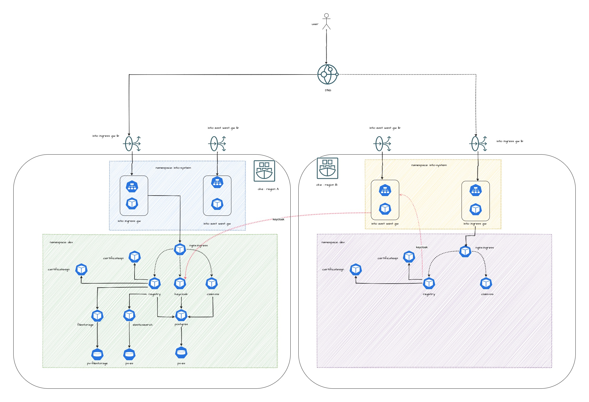

# Demo: Install Sunbird-RC in active-active deployment across different regions

Steps to orchestrate service mesh with [Sunbird-RC](https://rc.sunbird.org/learn/readme) across two different OKE clusters.



## Prerequisites

- [Install Multi-Primary on different networks](../istio-samples/multi-primary-diff-nw-oci/)

## Assumptions

For this deployment , we going to deploy stateful applications like postgres, keycloak, elastic search , filestorage only on cluster1

## Ansible inventory

create two inventory folders 

```
mkdir -p ~/inventory/env/dev/cluster1
mkdir -p ~/inventory/env/dev/cluster2
```

Copy the private inventory template 

```
cp istio-multicluster-setup/devops/private_repo/ansible/inv/dev/Core/* ~/inventory/env/dev/cluster1
cp istio-multicluster-setup/devops/private_repo/ansible/inv/dev/Core/* ~/inventory/env/dev/cluster2

```
update the inventory variables as per the requirement in secrets.yaml

